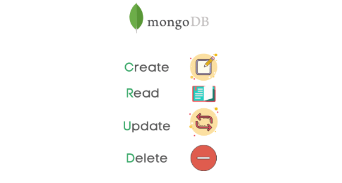
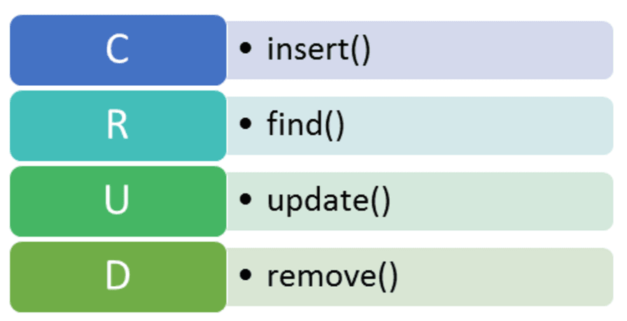

# Taller de MongoDB

sesion 1

---
layout: default

---

# Contenidos

* Introduccion
* MongoDB
* JSON
* BSON
* CRUD


---
layout: two-cols
---

<template v-slot:default>

# Introduccion

<!--  -->


</template>

<template v-slot:right>


</template>


---
layout: two-cols
---

<template v-slot:default>


# Relacionales (SQL)

- Los datos están organizados en tablas
- En las tablas existen columnas y registros
- Una tabla no puede estar dentro de otra tabla
- Una columna puede tener sólo un tipo de dato fijo


<br>
<br>


</template>
<template v-slot:right>


# No relacionales (No-SQL)

- Los datos no están organizados en tablas
- Las colecciones son un conjunto de objetos, nodos o documentos
- Cada colecion consta del nombre de una propiedad y su valor
- Existen coleccines `embebidas`


</template>

---

## Document Database

Un registro en MongoDB es un documento, que es una estructura de datos compuesta por pares de campos y valores.
Los valores de los campos pueden incluir otros documentos, arrays y arrays de documentos.
<!--  -->

<!--  -->

[mongodb manual](https://www.mongodb.com/docs/manual/introduction/#document-database)

---

## Las ventajas de usar documentos son:

<br>

1. Los documentos corresponden a tipos de datos nativos en muchos lenguajes de programación.

2. Los documentos y arrays incrustados reducen la necesidad de costosas operaciones de unión (joins).

3. El esquema dinámico permite un polimorfismo fluido.

4. Los índices brindan soporte para consultas más rápidas y pueden incluir claves de documentos y arrays incrustados.

---

```js
const { MongoClient } = require('mongodb');

const url = 'mongodb://localhost:27017';

const documentoJSON = {
  nombre: 'Juan',
  edad: 30,
  activo: true
};

async function insertarDocumento() {
  const client = new MongoClient(url);

  try {
  ...
  ...
    const resultado = await coleccion.insertOne(documentoJSON);
    console.log('Documento insertado:', resultado.insertedId);
  } catch (error) {
    console.error('Error al insertar el documento:', error);
  }
}

insertarDocumento();
```

---

```python
from pymongo import MongoClient

client = MongoClient('localhost', 12345)
db = client['collection']
coleccion = db['collection']

document = {
    "nombre": "Juan",
    "edad": 30,
    "activo": True
}

result = coleccion.insert_one(document)
```
---

# MongoDB

```
MongoDB es una base de datos de documentos que ofrece una gran escalabilidad y flexibilidad
y un modelo de consultas e indexación avanzado.

```
<br>

* Un registro en MongoDB es un documento, que es una estructura de datos compuesta por pares de campos y valores.
* Los documentos de MongoDB son similares a objetos JSON.
* MongoDB utiliza BSON (Binary JSON) como su formato de almacenamiento interno para documentos
---

# JSON

```json
{
  "_id": 1,
  "name" : { "first" : "John", "last" : "Backus" },
  "contribs" : [ "Fortran", "ALGOL", "Backus-Naur Form", "FP" ],
  "awards" : [
    {
      "award" : "W.W. McDowell Award",
      "year" : 1967,
      "by" : "IEEE Computer Society"
    }, {
      "award" : "Draper Prize",
      "year" : 1993,
      "by" : "National Academy of Engineering"
    }
  ]
}

```

---
class: px-20
---

# BSON

Binary jSON

```json
{"hello": "world"} →

\x16\x00\x00\x00           // total document size
\x02                       // 0x02 = type String
hello\x00                  // field name
\x06\x00\x00\x00world\x00  // field value
\x00                       // 0x00 = type EOO ('end of object')

```

```json
{"BSON": ["awesome", 5.05, 1986]} →

 \x31\x00\x00\x00
 \x04BSON\x00
 \x26\x00\x00\x00
 \x02\x30\x00\x08\x00\x00\x00awesome\x00
 \x01\x31\x00\x33\x33\x33\x33\x33\x33\x14\x40
 \x10\x32\x00\xc2\x07\x00\x00
 \x00
 \x00

```
---
layout: two-cols
---

<template v-slot:default>

# JSON VS BSON

* __Encoding:__ UTF-8 String
* __Data:__ String, Boolean, Number, Array
* __Human readable__

<!--  -->

</template>

<template v-slot:right>

<br>
<br>

* __Encoding:__ Binary
* __Data:__ String, Boolean, Number, (Integer, Long, ...)
    Array, Date, Raw Binary
* __Machine readable__

</template>

---

# Operaciones CRUD

<br>

<!--  -->


---

<!--  -->


---

# Insert

```sql
INSERT INTO table_name (column1, column2, column3, ...)
VALUES (value1, value2, value3, ...);
```

```js
db.collection.insert(
   <document or array of documents>,
   {
     writeConcern: <document>,
     ordered: <boolean>
   }
)
```

```sql
INSERT INTO table_name (column_list)
VALUES
    (value_list_1),
    (value_list_2),
    ...
    (value_list_n);
```

```js
db.collection.insertMany([
      { item: "card", qty: 15 },
      { item: "envelope", qty: 20 },
      { item: "stamps" , qty: 30 }
   ])
```

---

# Find

```js
db.collection.find(query, projection, options)
```

## Operations


```sql
SELECT * FROM table_name
```
```js
db.collection.find()
```
```sql
SELECT * FROM table_name WHERE field = "value":
```
```js
db.collection.find({field: "value"})
```
```sql
SELECT * FROM table_name WHERE field in ("value1", "value2");
```
```js
db.collection.find({field: {"$in": ["value1", "value2"]} })
```

---

## Using `AND` operator

```js
db.collection.find( {attribute1: "value1", attribute2: "value2"} )
```


## Using `OR` operator

```js
db.collection.find({field: {"$or": [ {attribute1: "value1" } , { attribute2: "value2" } ] } })
```

# Query Embedded Documents


# Exact match

```js
db.collection.find({ attribute: { innerAttribute1: "value1", innerAttribute2: "value2"} })
```

# Dot notation

```js
db.collection.find({ attribute.innerAttribute: "value"} })
```

---

# Query Arrays

## Exact Match

```js
db.collections.find( [ "value1", "value2" ] )
```

## All elements must be in Array

```js
db.collections.find( [ "value1", "value2" ] )
```

## Multiple criteria in Array Find

```js
db.collections.find( attribute: { $elementMatch: { $gt: value1, $lt: value2} } )
```

## Specific position in Array Find

```js
db.collections.find( { "attribute.0": "value" } )
```

## Array length Find

```js
db.collections.find( { attribute: { $size: integer } } )
```
---

# Configuracion de Atlas Cluster

[registro](https://www.mongodb.com/cloud/atlas/register)


---

# Mongo compass

[descarga](https://www.mongodb.com/products/compass)


---

# Projection

## Return Specific attribute

```js
db.collectiodb.find( {attribute1: "value1"}, {attribute1: 1, attribute2: 1} )
```

## Avoid _id

```js
db.collectiodb.find( {attribute1: "value1"}, {attribute1: 1, attribute2: 1, _id: 0} )
```

## All but avoid fields

```js
db.collectiodb.find( {attribute1: "value1"}, {attribute1: 0, attribute2: 0} )
```

---

# Update

## Operations

``` sql
UPDATE collection
SET
      <query>
WHERE  condition

```

```js
db.condition.update( {/**query**/}, {$set{attribute: value}} )
db.condition.updateMany( {/**query**/}, {$set{attribute: value}} )
```

## Agreggation pipeline usage

* `$set`
* `$addField`

---

# Delete

```js
db.collection.deleteMany({ /** some query **/ })

db.collection.deleteOne({ /** some query **/ }) // Delete all documents that match a specified filter.

db.collection.remove({ /** some query **/ }) // Delete a single document or all documents that
                                            //  match a specified filter.
```
---

# Modelamiento

## Metodologia


<style>
img {
  margin: auto;
  display: block;
}
</style>

---
layout: two-cols
---

<template v-slot:default>

# Patrones

<br>

## Embebido

<!--  -->


</template>

<template v-slot:right>

<br>
<br>
<br>

## Referenciado


</template>

---

# Relaciones

## Comunes

* One-to-One
* One-to-Many
* Many-to-Many


---

## Consideraciones

No todas las relaciones de 1:1 y 1:many deben ser representadas en un único documento. Se debe utilizar referencias entre documentos cuando:

* Un documento se lee con frecuencia pero contiene datos a los que rara vez se accede.
* Una parte del documento se actualiza con frecuencia o está creciendo en tamaño, mientras que el resto del documento es relativamente estático.
* Cuando el tamaño total del documento podría superar el límite de 16 MB de documentos de MongoDB.

---
layout: two-cols
---

<template v-slot:default>

Tomemos el siguiente ejemplo de un fabricante con un conjunto de modelos en forma de array.

Dado que los modelos a menudo se muestran de manera individual en lugar de como un conjunto,
realizar consultas a los datos requeriría una transformación antes de ser mostrados.
En este caso, tiene sentido mantener los modelos en su propia colección, haciendo referencia al fabricante en el documento.

Los modelos de automóviles se utilizan frecuentemente fuera del documento principal. Moverlos a una colección diferente es útil si estamos leyendo o escribiendo regularmente en la colección de modelos.

</template>

<template v-slot:right>


</template>

---
layout: two-cols
---

<template v-slot:default>

Duplicar (o redundar) permite evitar uniones innecesarias almacenando las mismas piezas de datos en varios documentos,
a costa de cierta complejidad adicional, para mantenerlos consistentes y actualizados.

MongoDB ofrece flujos de cambios y disparadores para ayudar a mantener sincronizados los datos duplicados en varios documentos.

</template>

<template v-slot:right>


</template>

---

# Index

Los índices respaldan la ejecución eficiente de consultas. Sin ellos, la base de datos debe escanear cada documento
en una colección o tabla para seleccionar aquellos que coinciden con la declaración de la consulta. Si existe un índice
adecuado para una consulta, la base de datos puede utilizar el índice para limitar la cantidad de documentos que debe inspeccionar.

La planificación de índices basada en tu carga de trabajo es importante para garantizar el rendimiento de tus consultas.

## Covered Query

Una consulta cubierta es una consulta que puede ser satisfecha completamente utilizando un índice y no necesita examinar ningún documento.
Un índice cubre una consulta cuando se cumplen todas las siguientes condiciones:

* todos los campos en la consulta son parte de un índice, y
* todos los campos devueltos en los resultados están en el mismo índice.
* ningún campo en la consulta es igual a nulo (es decir, {"campo": null} o {"campo": {$eq: null}}).

---

# Introduccion al aggregation framework

Procesar y analizar registros de datos, agrupando valores de varios documentos y realizando operaciones en los datos agrupados para entregar resultados en un único conjunto.

* Cada etapa realiza una operación en los documentos de entrada. Por ejemplo, una etapa puede filtrar documentos, agrupar documentos y calcular valores.
* Los documentos que se generan como salida de una etapa son enviados a la siguiente etapa.
* Una tubería de agregación puede devolver resultados para grupos de documentos. Por ejemplo, devolver los valores totales, promedio, máximo y mínimo.

---

# Agreggation Pipeline


Usualmente son usadas para:

* Agrupar valores de varios documentos juntos.
* Realizar operaciones en los datos agrupados para devolver un único resultado.
* Analizar cambios en los datos a lo largo del tiempo.

<style>
img {
  margin: auto;
  display: block;
}
</style>

---
# Single Purpose Aggregation Methods

Agregan documentos de una sola colección. Estos métodos son simples pero carecen de las capacidades de una tubería de agregación.
Method


```js
db.collection.count()
```

