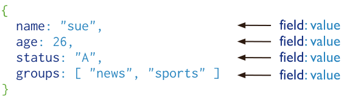

# Taller de MongoDb

sesion 1

---
layout: default

---

# Contenidos

* Introduccion
* MongoDB
* JSON
* BSON
* CRUD


---
layout: two-cols
---

<template v-slot:default>

# Introduccion

<!--  -->


</template>

<template v-slot:right>


</template>


---
layout: two-cols
---

<template v-slot:default>


<v-clicks>

# Relacionales (SQL)

- Los datos están organizados en tablas
- En las tablas existen columnas y registros
- Una tabla no puede estar dentro de otra tabla
- Una columna puede tener sólo un tipo de dato fijo

</v-clicks>

<br>
<br>

<v-click>


</v-click>

</template>
<template v-slot:right>


<v-clicks>

# No relacionales (No-SQL)

- Los datos no están organizados en tablas
- Las colecciones son un conjunto de objetos, nodos o documentos
- Cada colecion consta del nombre de una propiedad y su valor
- Existen coleccines `embebidas`

</v-clicks>
<v-click>


</v-click>


</template>

---

## Document Database

Un registro en MongoDB es un documento, que es una estructura de datos compuesta por pares de campos y valores.
Los valores de los campos pueden incluir otros documentos, arrays y arrays de documentos.
<!--  -->

<!--  -->

[mongodb manual](https://www.mongodb.com/docs/manual/introduction/#document-database)

---

## Las ventajas de usar documentos son:

<br>

1. Los documentos corresponden a tipos de datos nativos en muchos lenguajes de programación.

2. Los documentos y arrays incrustados reducen la necesidad de costosas operaciones de unión (joins).

3. El esquema dinámico permite un polimorfismo fluido.

4. Los índices brindan soporte para consultas más rápidas y pueden incluir claves de documentos y arrays incrustados.

---

```js
const { MongoClient } = require('mongodb');

const url = 'mongodb://localhost:27017';

const documentoJSON = {
  nombre: 'Juan',
  edad: 30,
  activo: true
};

async function insertarDocumento() {
  const client = new MongoClient(url);

  try {
  ...
  ...
    const resultado = await coleccion.insertOne(documentoJSON);
    console.log('Documento insertado:', resultado.insertedId);
  } catch (error) {
    console.error('Error al insertar el documento:', error);
  }
}

insertarDocumento();
```

---

```python
from pymongo import MongoClient

client = MongoClient('localhost', 12345)
db = client['collection']
coleccion = db['collection']

document = {
    "nombre": "Juan",
    "edad": 30,
    "activo": True
}

result = coleccion.insert_one(document)
```
---

# MongoDB

```
MongoDB es una base de datos de documentos que ofrece una gran escalabilidad y flexibilidad
y un modelo de consultas e indexación avanzado.

```
<br>

* Un registro en MongoDB es un documento, que es una estructura de datos compuesta por pares de campos y valores.
* Los documentos de MongoDB son similares a objetos JSON.
* MongoDB utiliza BSON (Binary JSON) como su formato de almacenamiento interno para documentos
---

# JSON

```json
{
  "_id": 1,
  "name" : { "first" : "John", "last" : "Backus" },
  "contribs" : [ "Fortran", "ALGOL", "Backus-Naur Form", "FP" ],
  "awards" : [
    {
      "award" : "W.W. McDowell Award",
      "year" : 1967,
      "by" : "IEEE Computer Society"
    }, {
      "award" : "Draper Prize",
      "year" : 1993,
      "by" : "National Academy of Engineering"
    }
  ]
}

```

---
class: px-20
---

# BSON

Binary jSON

```json
{"hello": "world"} →

\x16\x00\x00\x00           // total document size
\x02                       // 0x02 = type String
hello\x00                  // field name
\x06\x00\x00\x00world\x00  // field value
\x00                       // 0x00 = type EOO ('end of object')

```

```json
{"BSON": ["awesome", 5.05, 1986]} →

 \x31\x00\x00\x00
 \x04BSON\x00
 \x26\x00\x00\x00
 \x02\x30\x00\x08\x00\x00\x00awesome\x00
 \x01\x31\x00\x33\x33\x33\x33\x33\x33\x14\x40
 \x10\x32\x00\xc2\x07\x00\x00
 \x00
 \x00

```
---
layout: two-cols
---

<template v-slot:default>

# JSON VS BSON

* __Encoding:__ UTF-8 String
* __Data:__ String, Boolean, Number, Array
* __Human readable__

<!--  -->

</template>

<template v-slot:right>

<br>
<br>

* __Encoding:__ Binary
* __Data:__ String, Boolean, Number, (Integer, Long, ...)
    Array, Date, Raw Binary
* __Machine readable__

</template>

---

# Operaciones CRUD

<br>

<!--  -->


---

<!--  -->


